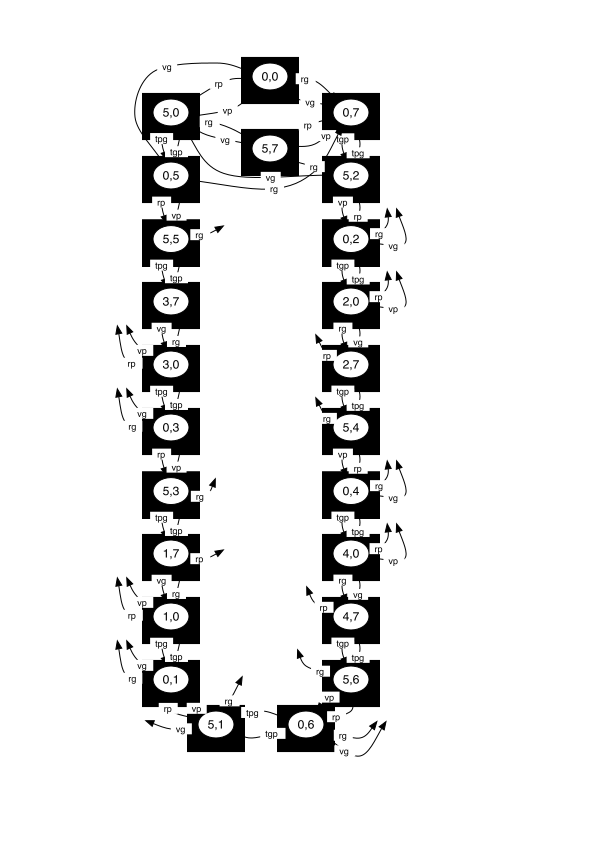
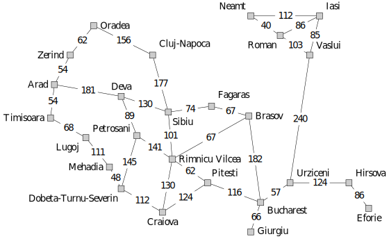
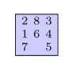
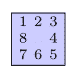

# Various_java_problems_and_games_solving
Various games and problems implemented and solved using Gradle 8.10 and Java 11

Compile the project using command line `gradle build` for creating the compiled file located in `./build/libs/iialib.jar`

## Games

### Domino

A simple domino game. The heuristics are given by the difference of number of possible placements remaining on the board for each player. Therefore, the heuristic is the difference between the number of possible horizontal placements and possible vertical placements for the player positioning the dominos horizontally and vice-versa.

Run the game with the command line :

`java -cp ./build/libs/iialib.jar games.dominos.DominosGame`

### Oware

The game Oware has a lot of different names depending on the geographical area. We use the name Awele in the code and we follow the rules as described on the Wikipedia page https://en.wikipedia.org/wiki/Oware. We slightly change the conditions for endgames to handle computational constraints by adding the rule to stop a game when there are 6 or less stones on the board (stones can also be called seeds depending on the description of the rules).

Let $scoreBottom$ be the score of the bottom player, $scoreTop$ be the score of the top player, $sumBOTTOM$ the sum of remaining seeds on the bottom side, $sumTOP$ the sum of remaining seeds on the top side, $nbMovesBOTTOM$ the number of possible moves of the bottom player, $nbMovesTOP$ the number of possible moves of the top player. The heuristics we consider for $h_{BOTTOM}$ and $h_{TOP}$ of bottom and top players respectively are :

$$
h_{BOTTOM} = 100*(scoreBottom-scoreTop) + 10*(sumTOP-sumBOTTOM) + (nbMovesBOTTOM - nbMovesTOP)
$$

$$
h_{TOP} = 100*(scoreTop-scoreBottom) + 10*(sumBOTTOM-sumTOP) + (nbMovesTOP - nbMovesBOTTOM)
$$

Run the game with the command line :

`java -cp ./build/libs/iialib.jar games.awele.AweleGame`

## Problems

### Jugs

We have two jugs (not graduated) for which we only know the respective capacities $P$ and $G$ (in litres) and a fountain with unlimited amount of water. The problem is to obtain a precise quantity of $C$ litres in one of the two jugs. The space of possible states is characterised by

$$
\mathcal{E} = \{(p,g) \in \llbracket 0,5 \rrbracket \times \llbracket 0,7 \rrbracket \}
$$  
where $p$ and $g$ represent respectively the contents of little and big jugs. The change-of-state operators are the following :

|   Operator  | Preconditions on the state (p,g) |  Effect  |
| ----------- | -------------------------------- | -------- |
| fp : fillP  |           $p \neq 5$             |  $(5,g)$ |
| fg : fillG  |           $g \neq 7$             |  $(p,7)$ |
| ep : emptyP |           $p \neq 0$             |  $(0,g)$ |
| eg : emptyG |           $g \neq 0$             |  $(p,0)$ |
| tpg : transferPtoG |    $p > 0 \wedge g < 7$   | $(max(0,p+g-7),min(7,p+g))$ |
| tgp : transferGtoP |    $g > 0 \wedge p < 5$   | $(min(5,p+g),max(0,p+g-5))$ |

The size of the state space is $|\mathcal{E}| = 6*8 = 48$ and the average branching factor $b$ is such that :

- If $(0 < p < 5)$ and $(0 < g < 7)$ so $4*6 = 24$ possible states, the $6$ operators are applicable
- If $(p = 0$ or $p = 5)$ and $(0 < g < 7)$ so $2*6 = 12$ possible states, only $4$ operators are applicable
- If $(g = 0$ or $g = 7)$ and $(0 < p < 5)$ so $2*4 = 8$ possible states, only $4$ operators are applicable
- If $(p = 0$ and $g = 0)$ or $(p = 5$ and $g = 7)$ so $2$ possible states, only $2$ operators are applicable
- If $(p = 0$ and $g = 7)$ or $(p = 5$ and $g = 0)$ so $2$ possible states, only $3$ operators are applicable

So $b = \frac{24*6 + 12*4 + 8*4 + 2*2 + 2*3}{48} = 4,875$

The state graph of the problem is given by

For each state, it is always possible in 2 transitions to empty or fill completely the two jugs. Those transitions are not represented exhaustively on the graph.

None of the state such that $(0<p<5)$ and $(0<g<7)$ are reached in practice, so the real branching factor is $b = \frac{12*4 + 8*4 + 2*2 + 2*3}{48} = 1,875$.

Solve the problem with the command line :

`java -cp ./build/libs/iialib.jar problems.jugs.RunJugsOtherAlgs`

An other instance is present in the folder and can be launched by the command line `java -cp ./build/libs/iialib.jar problems.jugs.RunJugsNaiveDFS`.
It shows that a naive depth-first search for this problem leads to a `StackOverflowError`.

### Turtles

A turtle on its back cannot turn over on its own. However, two turtles side by side can help each other and both turn over. Obviously, if one of the two was already on its feet, the move makes the one on his feet to fall on its back. However, this operation is only possible 
between two neighbouring turtles, and there's nothing to stop the two turtles from deciding to fall back on their back even if they were on their feet. Finally, reversing the situation of a turtle (on its back or on its feet) is done by reversing the situation of one of its neighbours. 

The problem to be solved is to find a succession of turtle reversals so that 6 turtles, which were in a certain initial position, all end up on their legs at the same time. In particular, we will study the problem where, in the initial state, only turtles 2 and 3 are on their feet. 

We must be able to solve in a similar way problems characterised by any other initial state.

Solve the problem with the command line :

`java -cp ./build/libs/iialib.jar problems.jugs.RunTurtleOtherAlgs`

An other instance is present in the folder and can be launched by the command line `java -cp ./build/libs/iialib.jar problems.jugs.RunTurtleNaiveDFS`.
It shows that a naive depth-first search for this problem leads to a `StackOverflowError`, even with cycle detection.

### Shortest path problem

We consider a tourist who has just finished a holiday in Romania and is looking for the shortest route to Bucharest airport.

We also consider the straight line distance between cities as the heuristic function :

We solve this problem thanks to $A^*$ algorithm with the command line :

`java -cp ./build/libs/iialib.jar problems.toBucharest.RunToBucharest`

### 15 puzzle

The game is also known as Mystic Square and rules are described at https://en.wikipedia.org/wiki/15_puzzle. Let's consider the initial state such as

and final state

The heuristic is the sum of Manhattan distances for each piece to its final position. We solve this problem thanks to $A^*$ algorithm.

We solve this problem thanks to $A^*$ algorithm with the command line :

`java -cp ./build/libs/iialib.jar problems.taquin.Run`

### Traveling salesman problem

Let's formalise the problem. It consists in finding the shortest path between $n$ cities, passing through each city just once before coming back to it's starting point. Let $V$ the set of cities to visit and $E$ the roads between each city. We construct an hamiltonian cycle, that is a cycle visiting each vertex of the graph $G = (V, E)$. As this cycle has to go through each city, we can formalise the problem by choosing any city $v_0 \in V$ as the starting point.

We can consider the set of possible spaces such as
$$
\mathcal{E} = \{(AV,vc) | AV \textit{ is a set of cities to visit }; vc   \textit{ is the current city of the traveler} \}
$$

The initial state is then $e_0 = (V, v_0)$ and the goal is to reach $(\emptyset,v_0)$

We can model the applicable operators by a parametric operator $reach(v)$.
- Preconditions :  $(v \in AV) \wedge (d(vc,v) \neq \infty)$
- New state :  $(AV \setminus \{v\}, v)$

The heuristic is the sum of the minimum distances corresponding to the roads going out of each city the traveler still has to visit.

We solve this problem thanks to $A^*$ algorithm with the command line :

`java -cp ./build/libs/iialib.jar problems.tsp.RunTSP`

The solving can take up to several minutes.